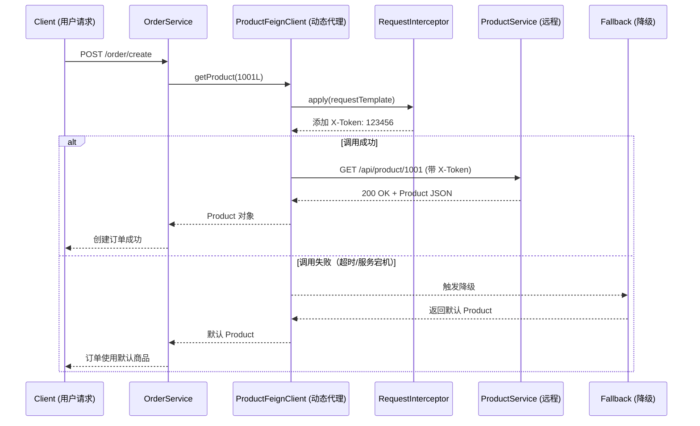

# 📚 知识回顾：OpenFeign 集成与远程调用重构

- **功能标题**：集成 OpenFeign 替代 RestTemplate 实现声明式远程服务调用
- **实现时间**：2026年05月24日 11:01:10
- **涉及技术**：OpenFeign、Resilience4j CircuitBreaker、RequestInterceptor、Feign Logger、Spring Cloud

---

## 一、功能概述

本次改动将 order 服务的远程调用方式从 **RestTemplate + DiscoveryClient + LoadBalancerClient** 重构为 **OpenFeign** 声明式调用，同时引入断路器降级、请求拦截器、Feign 日志等配套能力。

### 改了哪些文件？

| 文件 | 改动类型 | 作用 |
|------|---------|------|
| `OrderMainApplication.java` | 修改 | 添加 `@EnableFeignClients` 开启 Feign |
| `ProductFeignClient.java` | 新增 | 定义远程调用接口 |
| `ProductFeignClientFallback.java` | 新增 | 降级处理，返回默认商品 |
| `XTokenRequestInterceptor.java` | 新增 | 统一添加 X-Token 请求头 |
| `ProductConfig.java` | 修改 | 添加 Feign 日志级别 Bean |
| `OrderServiceImpl.java` | 修改 | 注入 FeignClient 替代 RestTemplate |
| `application.yml` | 修改 | 配置断路器、超时、日志级别 |
| `pom.xml` | 修改 | 添加 circuitbreaker 依赖 |

---

## 二、设计思路

### 为什么要从 RestTemplate 迁移到 OpenFeign？

```
RestTemplate 方式：
  OrderService → 手动拼接 URL → 手动处理负载均衡 → 手动解析响应

OpenFeign 方式：
  OrderService → 声明接口 + 注解 → Feign 自动完成
```

**核心痛点解决：**

| 问题 | RestTemplate | OpenFeign |
|------|-------------|-----------|
| URL 管理 | 代码中硬编码 `http://services-product/api/product/{id}` | 接口注解声明，集中管理 |
| 负载均衡 | 需注入 LoadBalancerClient 手动选择实例 | 内置 Ribbon/Spring Cloud LoadBalancer 集成 |
| 编码量 | 手动序列化/反序列化 | 内置契约，自动处理 |
| 可维护性 | 调用分散在各 Service 中 | 接口集中定义在 FeignClient |
| 容错 | 需手动 try-catch 实现降级 | 声明式 fallback 类 |

### 改造前后的调用链对比

**改造前：**
```
OrderService → DiscoveryClient.getInstances() → 获取实例列表
             → LoadBalancerClient.choose() → 负载均衡选一个
             → RestTemplate.getForObject(url, Product.class) → 发起 HTTP 请求
```

**改造后：**
```
OrderService → ProductFeignClient.getProduct(id) → Feign 自动完成
```

---

## 三、核心代码解析

### 3.1 开启 Feign：`@EnableFeignClients`

```java
@EnableFeignClients
@EnableDiscoveryClient
@SpringBootApplication
public class OrderMainApplication {
```

`@EnableFeignClients` 会扫描所有 `@FeignClient` 注解的接口，为每个接口生成动态代理对象，注入到 Spring 容器中。

### 3.2 声明 Feign 客户端：`ProductFeignClient`

```java
@FeignClient(value = "services-product", fallback = ProductFeignClientFallback.class)
public interface ProductFeignClient {
    @GetMapping("/api/product/{id}")
    public Product getProduct(@PathVariable("id") Long productId);
}
```

**原理**：你只需定义一个 Java 接口，用 Spring MVC 注解（`@GetMapping`、`@PathVariable`）描述请求的路径和参数。Feign 在运行时通过动态代理，将接口调用转换为真实的 HTTP 请求。

- `value = "services-product"` → 指定目标服务名，Feign 会通过服务发现将该名称解析为具体的 IP+端口
- `fallback = ProductFeignClientFallback.class` → 指定降级类，当调用失败时执行

### 3.3 断路器降级：`ProductFeignClientFallback`

```java
@Component
public class ProductFeignClientFallback implements ProductFeignClient {
    @Override
    public Product getProduct(Long productId) {
        Product product = new Product();
        product.setProductId(0L);
        product.setName("默认商品");
        product.setPrice(0.0D);
        return product;
    }
}
```

当调用 `services-product` 服务失败（网络超时、服务宕机、异常），Feign 不会抛出异常，而是调用这个 Fallback 类返回一个默认的 `Product` 对象，保证主流程不被中断。

**启用断路器**需要配置：
```yaml
spring.cloud.openfeign.circuitbreaker.enabled: true
```

以及依赖：
```xml
<dependency>
    <groupId>org.springframework.cloud</groupId>
    <artifactId>spring-cloud-starter-circuitbreaker-resilience4j</artifactId>
</dependency>
```

### 3.4 请求拦截器：`XTokenRequestInterceptor`

```java
@Component
public class XTokenRequestInterceptor implements RequestInterceptor {
    @Override
    public void apply(RequestTemplate requestTemplate) {
        requestTemplate.header("X-Token", "123456");
    }
}
```

**应用场景**：微服务之间调用往往需要传递认证信息（Token）、链路追踪 ID（TraceId）、来源标识等公共 Header。

**原理**：`RequestInterceptor` 是 Feign 提供的一个扩展点。在每次发送 HTTP 请求之前，Feign 会遍历所有注册的 `RequestInterceptor`，调用其 `apply` 方法，让你有机会修改 `RequestTemplate`（即请求模板）。这样所有经过 Feign 发出的请求都会自动携带 X-Token 头。

### 3.5 Feign 日志配置

```java
@Bean
Logger.Level feignLoggerLevel() {
    return Logger.Level.FULL;
}
```

```yaml
logger:
  level:
    com.felan.order.feign: debug
```

`Logger.Level` 有四个级别：

| 级别 | 输出内容 |
|------|---------|
| `NONE` | 不记录（默认） |
| `BASIC` | 仅记录请求方法、URL、响应状态码、执行时间 |
| `HEADERS` | 记录 BASIC + 请求和响应头 |
| `FULL` | 记录 HEADERS + 请求体、响应体（最详细） |

配合 `logging.level.com.felan.order.feign: debug` 配置，才能在控制台看到 Feign 的日志输出。

### 3.6 超时配置

```yaml
spring.cloud.openfeign.client.config.services-product:
  connectTimeout: 5000    # 建立连接超时（毫秒）
  readTimeout: 5000       # 等待响应超时（毫秒）
```

**connectTimeout**：与目标服务器建立 TCP 连接的超时时间。
**readTimeout**：连接建立后，等待服务器返回数据的超时时间。

---

## 四、调用流程时序图



---

## 五、知识点详解（入门级 → 进阶级）

### 5.1 OpenFeign 核心原理

> **Feign 的本质：通过动态代理将接口调用转化为 HTTP 请求**

**工作流程：**

1. **扫描阶段**：Spring 容器启动时，`@EnableFeignClients` 触发扫描，找到所有 `@FeignClient` 接口
2. **代理创建**：为每个接口创建 JDK 动态代理对象
3. **方法解析**：解析接口方法上的 `@GetMapping`、`@PostMapping`、`@PathVariable` 等注解，构建请求模板（URL、Method、Header、Body）
4. **调用阶段**：当调用代理对象的方法时：
   - 构建请求参数
   - 调用所有注册的 `RequestInterceptor`
   - 通过 HTTP 客户端（默认是 HttpURLConnection，可替换为 Apache HttpClient / OkHttp）发送请求
   - 解析响应状态码和体，反序列化为方法返回类型

### 5.2 OpenFeign 与 RestTemplate 的本质区别

| 维度 | OpenFeign | RestTemplate |
|------|-----------|--------------|
| 编程模型 | **声明式**：接口 + 注解 | **命令式**：代码 + 手动拼接 URL |
| 关注点分离 | 调用方无需关心 URL 拼接、序列化等细节 | 调用方需要手动处理每一项 |
| 代码复用性 | 一个接口多处注入使用 | 每个调用点重复编码 |
| 可测试性 | 接口可 Mock | 需 Mock RestTemplate |

**一个形象的类比：**

> RestTemplate 就像每次打电话都要手动拨号，OpenFeign 就像把联系人存进通讯录，喊一声名字就打过去了。

### 5.3 断路器模式（Circuit Breaker Pattern）

**三大状态：**

```
   正常 (CLOSED)
      │
      │ 失败次数超过阈值
      ▼
   熔断 (OPEN) ──→ 等待时间窗口过期 ──→ 半开 (HALF_OPEN)
      │                                          │
      │                                          ├── 请求成功 → CLOSED
      │                                          └── 请求失败 → OPEN
```

- **CLOSED（关闭）**：正常运行，请求正常通过
- **OPEN（打开/熔断）**：失败率超过阈值，直接返回降级结果，**不发起真实请求**
- **HALF_OPEN（半开）**：经过一段时间后，放行少量请求测试服务是否恢复

**本次配置的断路器链路：**
```
FeignClient 调用
    ↓ 失败
Resilience4j CircuitBreaker 检测到失败
    ↓ 触发熔断
Feign 调用 ProductFeignClientFallback
    ↓ 返回
默认 Product 对象
```

### 5.4 RequestInterceptor 应用场景

| 场景 | 说明 |
|------|------|
| 认证 Token 传递 | 从请求上下文获取 JWT Token，传递到下游服务 |
| 链路追踪 ID | 传递 TraceId 实现全链路日志追踪 |
| 客户端标识 | 附加服务名称、版本号等信息 |
| 语言/区域 | 传递 Accept-Language 等区域信息 |

---

## 六、实践建议

### 对于新手（了解层级 → 熟悉层级）

1. **动手搭建**：在本地启动两个 Spring Boot 服务，一个提供 API，一个用 Feign 调用，感受声明式调用的便利
2. **配置 Feign 日志**：将日志级别设为 `FULL`，观察 Feign 实际发送的 HTTP 请求内容，理解底层发生了什么
3. **故意触发降级**：停掉被调用的服务，观察 Fallback 是否生效，理解断路器的作用

### 进阶方向（熟悉层级 → 掌握层级）

1. **Feign 编码器/解码器**：了解如何自定义请求编码和响应解码
2. **Feign 客户端替换**：将默认的 `HttpURLConnection` 替换为 `OkHttp` 或 `Apache HttpClient`，获得连接池和更好的性能
3. **全局 Feign 配置 vs 服务级配置**：`default` 和 `services-product` 配置的区别
4. **超时与重试**：结合 `Retryer` 实现请求重试，结合断路器实现更健壮的调用

### 避坑指南

| 坑 | 说明 |
|----|------|
| Fallback 类需实现接口 | `ProductFeignClientFallback` 必须 `implements ProductFeignClient` |
| Fallback 需注入容器 | 必须加 `@Component` 注解 |
| `@PathVariable` 需指定 value | `@PathVariable("id")` 在 Spring Boot 2.x+ 必须指定名称 |
| logging.level 配错路径 | Feign 日志级别必须配到 `com.felan.order.feign` 包名，不是 `feign` |

---

*本回顾记录基于 2026年05月24日 的 OpenFeign 集成改动生成。*
