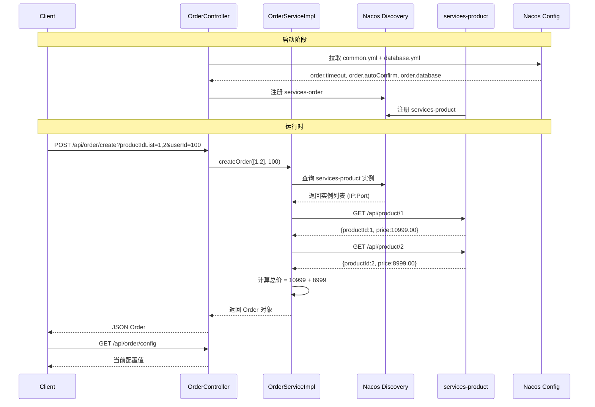

# 知识回顾：cloud-demo 微服务项目

- **功能标题**：基于 Spring Cloud Alibaba 的微服务订单-商品演示项目
- **实现时间**：2026年05月23日
- **涉及技术**：Spring Boot 4.0 / Spring Cloud 2025.1.1 / Spring Cloud Alibaba 2025.1.0.0 / Nacos / OpenFeign / LoadBalancer / RestTemplate / Java 26

---

## 1. 功能概述

这是一个**极简微服务演示系统**，包含两个服务：

| 服务 | 端口 | 职责 |
|------|------|------|
| `services-order` | 8001 | 创建订单，调用 product 服务查询商品价格 |
| `services-product` | 8002 | 提供商品查询 API |

核心流程：用户请求创建订单 → order 服务通过 Nacos 发现 product 服务 → 通过 RestTemplate 远程调用获取商品价格 → 计算总价 → 返回订单。

配置管理通过 **Nacos Config** 实现，order 服务从 Nacos 拉取 `common.yml` 和 `database.yml` 配置。

---

## 2. 设计思路

**为什么要微服务？** 将订单和商品拆分为独立服务，各自独立部署、独立扩展、独立维护。

**为什么要 Nacos？**
- **服务发现**：product 服务实例会动态变化（扩缩容、重启），order 服务通过 Nacos 获取可用实例列表，而非硬编码地址
- **配置中心**：配置统一管理、支持热更新，无需重启服务即可修改超时时间等参数

**技术选型对比：**

| 能力 | 选型 | 替代方案 |
|------|------|---------|
| 服务发现 | Nacos | Eureka（已停维护）、Consul、Zookeeper |
| 配置中心 | Nacos Config | Apollo、Spring Cloud Config |
| 服务调用 | RestTemplate + LoadBalancer | OpenFeign（声明式，更推荐） |
| 负载均衡 | Spring Cloud LoadBalancer | Ribbon（已进入维护状态） |

> 项目中已引入 OpenFeign 依赖但未使用 — 这是常见的迁移路径：先用 RestTemplate 快速验证，后续替换为 Feign。

---

## 3. 核心代码解析

### 3.1 Nacos 服务发现 — `OrderServiceImpl.java:45-55`

```java
List<ServiceInstance> instances = discoveryClient.getInstances("services-product");
if (instances == null || instances.isEmpty()) {
    throw new RuntimeException("没有找到 services-product 服务实例");
}
String productServiceUrl = "http://services-product" + "/api/product/" + productId;
Product product = restTemplate.getForObject(productServiceUrl, Product.class);
```

**原理**：`DiscoveryClient` 是 Spring Cloud 的抽象接口，Nacos 提供了实现。`getInstances("services-product")` 向 Nacos 服务端查询 `services-product` 的所有健康实例，返回包含 IP 和端口的信息。结合 `@LoadBalanced` RestTemplate，`http://services-product/api/product/1` 中的 `services-product` 会被拦截替换为实际 IP:Port。

### 3.2 负载均衡 RestTemplate — `ProductConfig.java`

```java
@Bean
@LoadBalanced
public RestTemplate getRestTemplate() {
    return new RestTemplate();
}
```

`@LoadBalanced` 是一个**限定符注解**（qualifier），Spring Cloud 会为带此注解的 RestTemplate 注入一个 `LoadBalancerInterceptor`，拦截 HTTP 请求，将服务名解析为真实地址。

### 3.3 Nacos 配置绑定 — `OrderProperties.java`

```java
@Component
@ConfigurationProperties(prefix = "order")
@Data
public class OrderProperties {
    String timeout;
    String autoConfirm;
    String database;
}
```

`@ConfigurationProperties(prefix = "order")` 将配置中以 `order.` 为前缀的所有属性自动绑定到 Java 字段，支持**松散绑定**（`timeout` ← `order.timeout` 或 `order.time-out` 或 `order.TIMEOUT`）。

### 3.4 配置热刷新 — `OrderController.java`

```java
@RefreshScope
@RestController
@RequestMapping("/api/order")
public class OrderController {
    @Autowired
    private OrderProperties orderProperties;

    @GetMapping("/config")
    public String getNacosConfig() {
        return "OrderTimeout=" + orderProperties.getTimeout()
            + ",autoConfirm=" + orderProperties.getAutoConfirm()
            + ",database=" + orderProperties.getDatabase();
    }
}
```

`@RefreshScope` 是关键 — 被标注的 Bean 会在配置变更时重新创建，从而获取最新配置值。不标注的话，即使 Nacos 配置更新了，Bean 中的值仍然是旧的。

---

## 4. 时序图



---

## 5. 知识点详解

### 5.1 Nacos 服务发现（核心原理）

**Nacos 在服务发现中的角色是注册中心（Registry）**：

- **服务注册**：每个服务实例启动时，向 Nacos Server 发送注册请求（服务名、IP、端口、健康检查地址）
- **健康检查**：Nacos Server 定期向服务实例发送心跳检测，超时未响应的实例被标记为不健康
- **服务发现**：消费者调用 `discoveryClient.getInstances("service-name")` 时，Nacos 返回健康的实例列表
- **保护阈值**：当健康实例比例低于阈值时，Nacos 会返回所有实例（包括不健康的），防止雪崩

**与 Eureka 的关键区别**：

| 特性 | Nacos | Eureka（已停维护） |
|------|-------|-------------------|
| CAP 理论 | CP+AP 可切换 | AP |
| 配置中心 | 内置 | 需额外引入 |
| 控制台 | 自带 Web UI | 需额外搭建 |
| 协议 | gRPC + HTTP | HTTP + 心跳 |

### 5.2 @ConfigurationProperties 深度解析

**绑定规则（Relaxed Binding）**：

Spring Boot 的宽松绑定规则按优先级：
1. `order.timeout` → `timeout`（精确匹配）
2. `order.time-out` → `timeout`（kebab-case，YAML 推荐）
3. `order.TIMEOUT` → `timeout`（大写）
4. `order.timeOut` → `timeout`（驼峰）

**工作原理**：`@ConfigurationProperties` 的处理器在 `postProcessBeforeInitialization` 阶段，从 `Environment` 中提取所有 `order.*` 属性，通过 setter（Lombok `@Data` 生成）或直接字段赋值注入。

### 5.3 @RefreshScope 与配置热更新

Spring Cloud 的 `@RefreshScope` 本质上是**作用域 Bean**（类似 `@Scope("singleton")` 或 `@Scope("prototype")`），但它是一个**自定义作用域 `refresh`**：

1. Nacos 配置变更 → 发布 `RefreshEvent`
2. `RefreshEventListener` 收到事件 → 清空 `refresh` 作用域中所有 Bean 的缓存
3. 下次请求访问这些 Bean 时 → 重新创建 Bean 实例 → 从更新后的 Environment 中获取新配置值

**注意**：`@RefreshScope` 只能刷新当前 Bean 中的属性值，不能刷新以下内容：
- `@ConditionalOnProperty` 的条件判断
- 通过 `@Scheduled` 解析的 cron 表达式
- Environment 中已解析但在 Bean 初始化外使用的值

### 5.4 @LoadBalanced 与 LoadBalancerInterceptor

`@LoadBalanced` 是一个**自定义限定符**，Spring Cloud 通过它注入 `LoadBalancerInterceptor`：

```java
// LoadBalancerInterceptor 工作流程
// 1. 拦截 HTTP 请求 → 提取服务名 "services-product"
// 2. loadBalancer.choose("services-product") → 负载均衡选择实例
// 3. 替换 URL 中的服务名为实际 IP:Port
// 4. 发送真实 HTTP 请求
```

**Spring Cloud LoadBalancer 的策略**（默认轮询）：

| 策略 | 说明 | 配置 |
|------|------|------|
| 轮询 | 依次选择 | 默认 |
| 随机 | 随机选择 | `RandomLoadBalancer` |
| 权重 | 按权重分配 | 需结合 Nacos 权重配置 |

### 5.5 Maven 多模块管理

```
cloud-demo (pom)               ← 根：统一管理版本号、公共依赖
├── model (jar)                ← 共享 Bean，所有服务模块依赖
└── services (pom)             ← 聚合器：共享微服务依赖
    ├── services-order (jar)   ← 订单服务
    └── services-product (jar) ← 商品服务
```

**依赖传递**：
- `services/pom.xml` 声明了 `nacos-discovery`、`openfeign`、`model` 等公共依赖，两个子模块自动继承
- `services-order/pom.xml` 额外声明 `spring-boot-starter-web`（只有它需要暴露 HTTP API）
- BOM（Bill of Materials）统一管理版本号，避免版本冲突

### 5.6 服务间调用的演进

项目中展示了**三种服务调用方式**，代表了三种不同阶段：

| 方式 | 代码 | 优缺点 |
|------|------|--------|
| DiscoveryClient + 手动拼 URL | `getInstances()` + `http://ip:port/path` | 代码繁琐，但理解原理最直观 |
| @LoadBalanced RestTemplate | `http://services-product/path` | 简洁，但接口是字符串不安全 |
| OpenFeign（已引入依赖） | `@FeignClient("services-product")` 声明式接口 | 最简洁，编译期检查，推荐生产使用 |

---

## 6. 实践建议

### 6.1 配置为 null 的完整排查思路

```
application.yml 没定义 order.* 属性
→ Nacos Config 连不上 / 没定义
→ @ConfigurationProperties(prefix) 拼写错误
→ 字段名与属性名不匹配（建议用 kebab-case: order.timeout）
→ @Component 没被扫描到
→ 配置热更新时 Bean 不是 @RefreshScope
```

### 6.2 学习路径建议

| 阶段 | 目标 |
|------|------|
| 入门 | 理解服务发现 + RestTemplate 调用 → 理解 Nacos 配置管理 |
| 进阶 | OpenFeign 替代 RestTemplate → 集成 Sentinel 熔断限流 → 集成 Gateway |
| 深入 | Nacos 集群部署与高可用 → gRPC 协议原理 → 源码级理解负载均衡策略 |

### 6.3 常见误区和改进点

1. **`@EnableDiscoveryClient` 可省略** — Spring Cloud 2020+ 自动配置，无需显式标注
2. **`OrderServiceImpl` 中重复标注 `@EnableDiscoveryClient`** — 只需在 `@SpringBootApplication` 类上标注一次即可
3. **缺少配置验证** — `OrderProperties` 中的字段没有默认值，建议加 `@NotNull` 或 `@DefaultValue`
4. **Nacos Config 配置分离** — 当前 `application.yml` 中混用了本地配置和 Nacos 配置，建议职责分明的分组管理
5. **Product 服务返回固定数据** — 实际项目应集成数据库（MyBatis/JPA）提供真实数据

---

*上一页回顾：无（首次生成）*