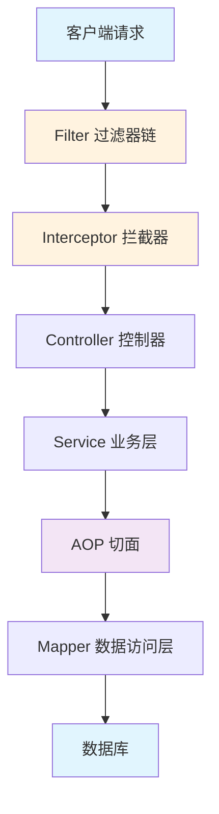
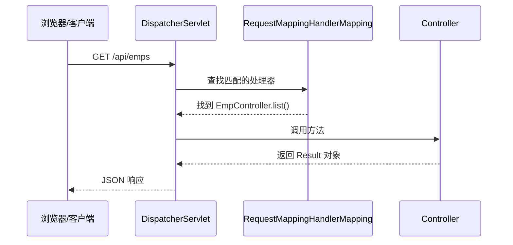
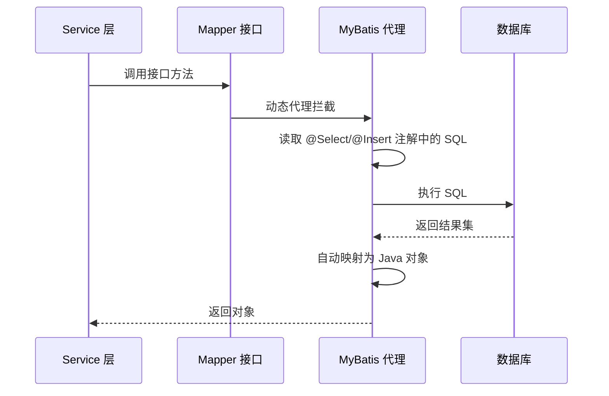
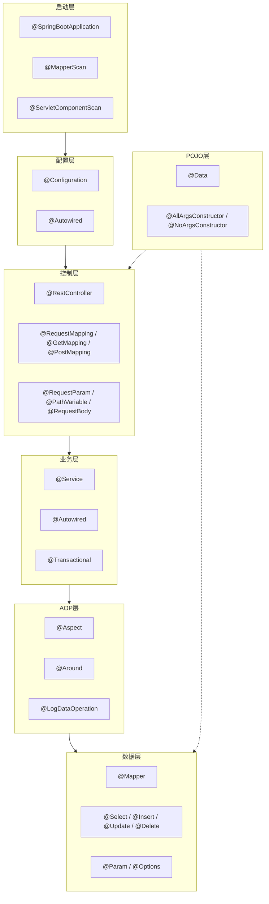

# 📚 知识回顾：Spring Boot + MyBatis 项目注解体系

- **功能标题**：Spring Boot + MyBatis 项目注解体系
- **实现时间**：2026年05月17日 21:09
- **涉及技术**：Spring Boot / Spring MVC / Spring AOP / MyBatis / Lombok / AspectJ

---

## 1. 功能概述

本项目是一个基于 **Spring Boot + MyBatis** 的后端应用，包含员工管理、部门管理、文件上传、登录认证、操作日志等模块。项目大量使用注解来简化配置、实现功能，注解贯穿了整个**组件注册、依赖注入、请求映射、数据访问、事务管理、AOP 切面**等环节。

### 为什么需要使用注解？

- 替代繁琐的 XML 配置
- 代码更简洁、可读性更强
- 声明式编程：告诉框架"做什么"，而不是"怎么做"

---

## 2. 设计思路



**各层职责：**
- **Filter** — Servlet 原生过滤器，最早介入请求（`AuthFilter`）
- **Interceptor** — Spring MVC 拦截器，在 Controller 前后执行（`AuthCheckInterceptor`）
- **Controller** — 接收请求、返回响应
- **Service** — 业务逻辑
- **AOP** — 横向切面逻辑（性能监控、操作日志）
- **Mapper** — 数据库访问（MyBatis）

---

## 3. 核心知识点详解

### 3.1 Spring 组件注册注解

**核心注解对比：**

| 注解 | 用途 | 示例位置 |
|------|------|----------|
| `@SpringBootApplication` | 启动入口，组合三个注解 | `MybatisApplication` |
| `@Configuration` | 配置类，声明 `@Bean` 或实现配置接口 | `WebConfig` |
| `@Component` | 通用组件，Spring 自动扫描注册 | `AuthFilter`、切面类 |
| `@Service` | 业务层组件（语义化 `@Component`） | `AuthServiceImpl`、`EmpServiceImpl` |
| `@RestController` | REST 控制器，返回 JSON | `EmpController`、`DeptControlller` |

**原理：** Spring 启动时，`@ComponentScan` 扫描指定包路径，找出所有标记了上述注解的类，实例化后放入 **IoC 容器（一个大的 Map）** 中统一管理。`@RestController` 额外包含了 `@ResponseBody`，让返回值自动序列化为 JSON。

**应用场景：**
- 任何需要 Spring 管理的类都要加注解
- 控制层用 `@RestController`，业务层用 `@Service`，配置类用 `@Configuration`

---

### 3.2 依赖注入注解

| 注解 | 作用 | 原理 |
|------|------|------|
| `@Autowired` | 自动注入依赖对象 | Spring 按类型匹配从容器中查找 Bean，赋值给字段 |
| `@Value` | 注入配置文件属性值 | 从 `application.yml` 读取值赋给字段 |

**示例图解：**

```text
@Service
public class EmpServiceImpl {
    @Autowired                    ← Spring 在初始化时，从容器中找到 EmpMapper 对象注入
    private EmpMapper empMapper;   ← 不需要 new，不需要 setter
}
```

**应用场景：** 任何类需要用到另一个类时，用 `@Autowired` 注入，避免手动 `new`。

---

### 3.3 Web 请求映射注解

**请求处理流程：**



**注解说明：**

| 注解 | HTTP 方法 | 用途 |
|------|-----------|------|
| `@GetMapping` | GET | 查询数据 |
| `@PostMapping` | POST | 新增数据 |
| `@PutMapping` | PUT | 更新数据 |
| `@DeleteMapping` | DELETE | 删除数据 |
| `@RequestMapping` | 任意 | 类级别定义基础路径 |

**参数绑定注解：**

| 注解 | 参数来源 | 示例 |
|------|----------|------|
| `@RequestParam` | 查询参数 | `?page=1&size=10` |
| `@PathVariable` | URL 路径 | `/emps/100` 中的 `100` |
| `@RequestBody` | 请求体 JSON | `{"name":"张三"}` |

---

### 3.4 AOP 切面编程

**什么是 AOP？**
AOP（面向切面编程）允许在不修改原有代码的情况下，在方法执行前后插入额外逻辑。

**代理模式示意图：**

```text
调用方 → [代理对象] → 真实对象
              ↓
         执行额外逻辑（日志/性能监控/事务）
```

**本项目中的 AOP：**

```java
@Aspect           // 标记为切面类
@Component        // 注册为 Bean
public class TimeAspect {
    
    @Around("execution(* com.fenghaze.mybatis.service..*(..))")
    //       ↑ 切点表达式：匹配 service 包下所有类的所有方法
    public Object recordTime(ProceedingJoinPoint pjp) {
        long start = System.currentTimeMillis();
        Object result = pjp.proceed();  // 执行目标方法
        long end = System.currentTimeMillis();
        log.info("方法 {} 耗时 {}ms", methodName, end - start);
        return result;
    }
}
```

**两种动态代理原理：**

| 代理方式 | 适用条件 | 原理 |
|----------|----------|------|
| JDK 动态代理 | 目标类有接口 | 运行时创建接口的实现类 |
| CGLIB 代理 | 目标类无接口 | 通过字节码生成子类 |

**应用场景：** 日志记录、性能监控、事务管理、权限检查。

---

### 3.5 MyBatis 数据访问注解

**工作流程：**



**核心注解：**

| 注解 | 作用 | 示例 |
|------|------|------|
| `@Mapper` | 标记 Mapper 接口 | `public interface EmpMapper` |
| `@Select("SQL")` | 查询 | `@Select("SELECT * FROM emp")` |
| `@Insert("SQL")` | 新增 | `@Insert("INSERT INTO emp ...")` |
| `@Update("SQL")` | 更新 | `@Update("UPDATE emp SET ...")` |
| `@Delete("SQL")` | 删除 | `@Delete("DELETE FROM emp WHERE id=#{id}")` |
| `@Param("name")` | 参数命名 | 映射 `#{name}` 到方法参数 |
| `@Options(useGeneratedKeys=true)` | 获取自增 ID | INSERT 后回写主键到对象 |

**关键原理：** MyBatis 在启动时为每个 `@Mapper` 接口创建 **JDK 动态代理**，方法调用时从注解中读取 SQL，通过 `SqlSession` 执行，结果自动映射为 POJO 对象。

---

### 3.6 Lombok 编译期注解

**原理对比：**

```text
编写代码时：
@Data
public class Emp {
    private Integer id;
    private String name;
}

编译时（Lombok 注解处理器介入）：
public class Emp {
    private Integer id;
    private String name;
    
    public Integer getId() { return id; }
    public void setId(Integer id) { this.id = id; }
    public String getName() { return name; }
    public void setName(String name) { this.name = name; }
    // 还有 toString()、equals()、hashCode() ...
}
```

**Lombok 是在编译期生成代码**，不是运行时，所以不影响性能。

| 注解 | 生成的代码 |
|------|-----------|
| `@Data` | Getter + Setter + toString + equals + hashCode |
| `@AllArgsConstructor` | `public Emp(Integer id, String name) { ... }` |
| `@NoArgsConstructor` | `public Emp() { }` |
| `@Slf4j` | `private static final Logger log = ...` |

---

### 3.7 自定义注解

**定义自定义注解三要素：**

```java
@Target(ElementType.METHOD)   // ① 这个注解可以用在哪里（方法上）
@Retention(RetentionPolicy.RUNTIME)  // ② 保留到什么时候（运行时）
public @interface LogDataOperation {  // ③ 定义注解名
    String value() default "";
}
```

**配合 AOP 使用：**

```text
@LogDataOperation                    ← 标记需要记录日志的方法
public void addDept(Dept dept) { ... }

↓ 运行时 AOP 切面拦截 ↓

@Around("@annotation(com...LogDataOperation)")
public Object logOperation(ProceedingJoinPoint pjp) {
    // 通过反射获取 @LogDataOperation 的值
    // 记录操作日志到数据库
    return pjp.proceed();
}
```

**应用场景：** 操作日志、权限控制、缓存注解、限流注解。

---

## 4. 各层注解使用全景图



---

## 5. 实践建议

### 学习路线

| 阶段 | 内容 | 行动建议 |
|------|------|----------|
| ① 基础 | Spring IoC + DI | 动手写一个 `@Service` + `@Autowired` 的例子，理解"容器"概念 |
| ② MVC | 请求映射 + 参数接收 | 创建一个 CRUD 控制器，尝试不同的参数接收方式 |
| ③ 数据 | MyBatis 注解 | 写一个完整的 Mapper 接口，手动执行 CRUD |
| ④ 切面 | AOP | 给 Service 加上 `@Around` 打印耗时，观察代理效果 |
| ⑤ 深入 | 源码阅读 | 逐行读 `@SpringBootApplication` 的组合注解源码 |

### 常见误区

1. **`@Autowired` 和 `new` 混用** — 被 Spring 管理的类才能用 `@Autowired`，`new` 出来的对象不生效
2. **忘记加 `@Mapper`** — Mapper 接口不加该注解会导致启动报错
3. **`@Transactional` 同类调用失效** — 事务基于 AOP 代理，同一类中的方法相互调用不走代理
4. **`@Around` 忘记调用 `pjp.proceed()`** — 会导致目标方法不执行

### 进阶方向

- 理解 Spring 源码中 `@Configuration` 的 CGLIB 代理如何保证单例
- 学习 Spring Boot 自动配置原理（`@EnableAutoConfiguration` → `spring.factories`）
- 研究 Spring AOP 的切面执行顺序（`@Order` 控制）
- 对比 MyBatis 注解方式 vs XML 方式的优劣

---

*上一页回顾：无（首次记录）*
